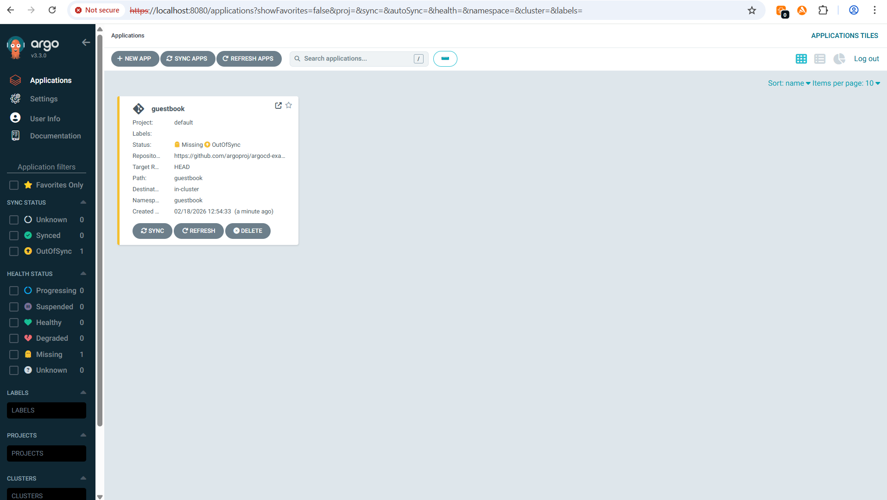
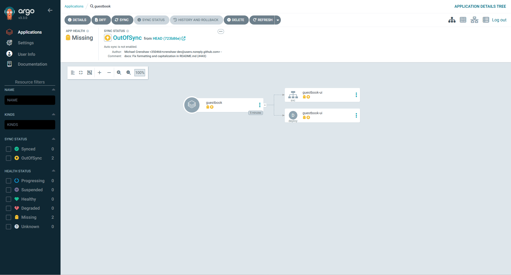
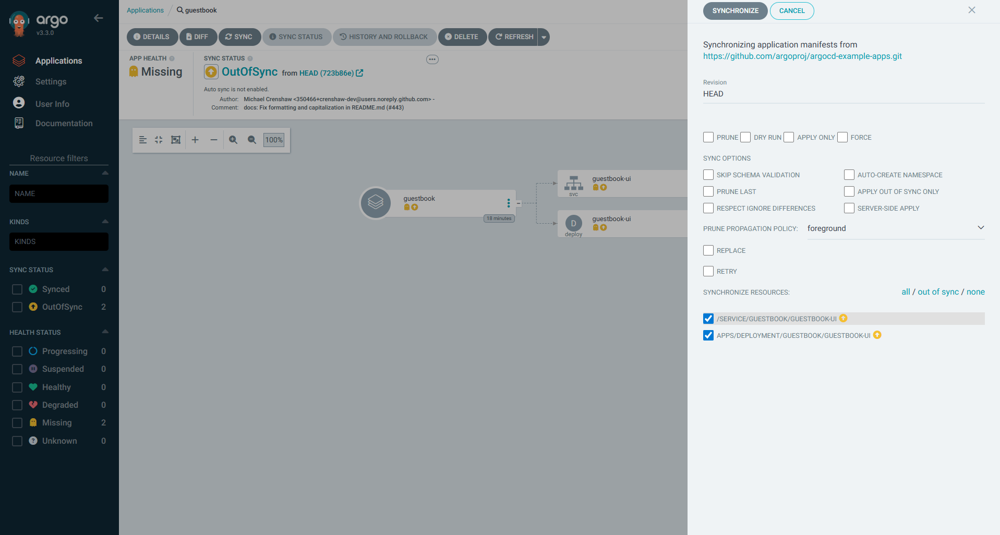
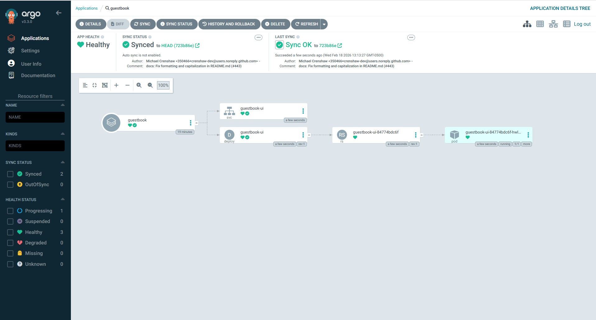

# Demo-03: ArgoCD Application CRD

## Demo Overview

This demo introduces the **ArgoCD Application Custom Resource Definition (CRD)** — the core building block of GitOps with ArgoCD. Before jumping into ArgoCD's Application CRD, we first build a solid mental model of how Kubernetes resource definitions, custom resource definitions (CRDs), and controllers work. Without that foundation, ArgoCD's Application CRD can feel confusing or even magical.

**What you'll learn:**
- What Kubernetes resource definitions are and how they enforce schema validation
- What CRDs are and how they extend Kubernetes (making it modular and extensible)
- What controllers and reconciliation loops do — and why not every resource has one
- What the ArgoCD Application CRD is and why it exists
- How the `Application` resource acts as a bridge between a Git repository and a Kubernetes cluster
- The difference between **Sync Status** and **Health Status** in ArgoCD
- How ArgoCD automatically injects namespace and annotations — and why that's powerful

**What you'll do:**
- Inspect the CRDs registered by ArgoCD in your cluster
- Create your first `Application` custom resource using `kubectl apply`
- Observe ArgoCD reconcile desired state from Git into the cluster
- Trigger a manual sync and watch the application go from `OutOfSync → Synced` and `Missing → Healthy`
- Access the deployed Guestbook app via port-forwarding

## Prerequisites

- ✅ Completed Demo-01 — core concepts understood
- ✅ Completed Demo-02 — ArgoCD installed
- ✅ ArgoCD pods are running (`kubectl get pods -n argocd`)
- ✅ ArgoCD UI accessible via port-forwarding on `localhost:8080`
- ✅ `kubectl` configured and pointing to your cluster

**Verify Prerequisites:**

### 1. Check ArgoCD pods are running
```bash
kubectl get pods -n argocd
```

**Expected:**
```
NAME                                                READY   STATUS    RESTARTS   AGE
argocd-application-controller-0                     1/1     Running   0          1d
argocd-applicationset-controller-xxx                1/1     Running   0          1d
argocd-dex-server-xxx                               1/1     Running   0          1d
argocd-notifications-controller-xxx                 1/1     Running   0          1d
argocd-redis-xxx                                    1/1     Running   0          1d
argocd-repo-server-xxx                              1/1     Running   0          1d
argocd-server-xxx                                   1/1     Running   0          1d
```

### 2. Ensure port-forwarding is active for ArgoCD UI
```bash
kubectl port-forward svc/argocd-server -n argocd 8080:443
```

Open `http://localhost:8080` in your browser — you should see the ArgoCD login page.

---

## Demo Objectives

By the end of this demo, you will:

1. ✅ Understand what Kubernetes resource definitions are and how they enforce schema
2. ✅ Understand what CRDs are and how they make Kubernetes extensible
3. ✅ Understand what a controller does and why the reconciliation loop matters
4. ✅ Understand what the ArgoCD `Application` CRD represents
5. ✅ Know how `source` and `destination` fields connect Git to a cluster
6. ✅ Know why `Application` resources must be created in the `argocd` namespace
7. ✅ Understand the difference between Sync Status and Health Status
8. ✅ Create your first `Application` resource and watch ArgoCD sync it

---

## Concepts

### Kubernetes Resource Definitions (Built-in APIs)

When a Kubernetes cluster is bootstrapped, a set of **resource definitions** already exists. You can see all of them by running:

```bash
kubectl api-resources
```

A resource definition defines a **schema** — a contract that says: "if you want to create a resource of this type, your YAML must contain these fields in this structure." For example, the `Deployment` resource definition enforces that you must have `spec.selector`, `spec.template`, etc. If you miss a mandatory field or indent something incorrectly, Kubernetes returns an error. If your YAML adheres to the schema, Kubernetes creates the resource successfully.

**Built-in resource** = user-created instance of a built-in API that declares a desired state for Kubernetes to act on.

---

### What Makes Kubernetes Extensible — CRDs

Kubernetes is described as **extensible** and **modular** — and this is achieved through **Custom Resource Definitions (CRDs)**. CRDs let you (or a vendor, or an open-source project) define entirely new resource types with their own schemas. Once a CRD is registered in the cluster, you can create **Custom Resources** — instances of that CRD — just like you create Deployments or Services.

```
Built-in API  →  Resource           (e.g., kind: Deployment)
Custom CRD    →  Custom Resource    (e.g., kind: Application)
```

### ArgoCD CRDs

The moment you install ArgoCD onto your cluster, ArgoCD registers its own CRDs. 

 `kubectl api-resources | grep argo` shows new resource types that did not exist before installation.

**Expected Output:**
 ```
NAME                                SHORTNAMES         APIVERSION                        NAMESPACED   KIND
applications                        app,apps           argoproj.io/v1alpha1              true         Application
applicationsets                     appset,appsets     argoproj.io/v1alpha1              true         ApplicationSet
appprojects                         appproj,appprojs   argoproj.io/v1alpha1              true         AppProject
 ```

---

### Controllers and Reconciliation Loops

A **controller** is the brain behind a resource. Its job is to run a continuous loop:

```
Observe desired state (from the manifest/Git)
    ↓
Compare with current state (what is actually running)
    ↓
Take action to reconcile (create, delete, update resources)
```

Not every resource needs a controller. `ConfigMaps` and `Secrets` are static — once created, they do not drift. But a `Deployment` can drift (a pod crashes, a node dies), so the Deployment Controller constantly watches and reconciles. A `CronJob` has a CronJob Controller that ensures the defined schedule is always respected.

When a CRD comes with a dedicated controller, this combination is called the **Operator Pattern**. **ArgoCD is an operator:**

- ArgoCD defines CRDs (e.g., `Application`, `AppProject`, `ApplicationSet`)
- ArgoCD runs an **Application Controller** that reconciles the desired state from Git into the cluster

---

### What is the ArgoCD Application CRD?

> **Important distinction:** `Application` as a term belongs to **ArgoCD**, not your deployed microservice/app. When we say "Application resource", we mean the ArgoCD custom resource of `kind: Application`, not your running pods.

The `Application` resource **connects a Git repository (source) to a Kubernetes cluster (destination)**. It is the fundamental unit of GitOps in ArgoCD — one `Application` resource maps to one independently deployable unit.

**What counts as one deployable unit?**

| Architecture | Deployable Unit | Git Repo |
|---|---|---|
| Microservices | One microservice | One repo per microservice (recommended) |
| Three-tier app | One tier (web, app, or db) | One repo per tier |
| Monolith | The whole application | One repo |

> **Best practice:** One Git repository per microservice. You can use a mono-repo with subdirectories, but in that case you create one `Application` resource per subdirectory path — you do NOT create one Application resource for the whole repo.

---

### Anatomy of an Application Resource

```yaml
apiVersion: argoproj.io/v1alpha1       # ArgoCD's API group — registered when ArgoCD was installed
kind: Application                       # The CRD kind defined by ArgoCD
metadata:
  name: guestbook                       # Name of this Application resource
  namespace: argocd                     # ← MUST be the namespace where ArgoCD is installed
spec:
  project: default
  source:
    repoURL: https://github.com/argoproj/argocd-example-apps   # Git repo URL
    targetRevision: HEAD                # HEAD = latest commit on the default branch (main/master)
    path: guestbook                     # Directory inside the repo containing your manifests
  destination:
    server: https://kubernetes.default.svc   # Target cluster (local cluster in this case)
    namespace: guestbook                     # Namespace to deploy resources into
```

**Key fields explained:**

**`namespace: argocd` (metadata)** — All ArgoCD custom resources (`Application`, `AppProject`, etc.) must be created in the namespace where ArgoCD itself is deployed. This is `argocd` in our case. This is not the namespace where your application pods run — that is defined separately in `spec.destination.namespace`.

**`spec.source.targetRevision: HEAD`** — `HEAD` points to the latest commit on the default branch of your repository. The default branch is typically `main` or `master` (you can verify this in your GitHub repo settings).

**`spec.source.path`** — The directory inside the repo where ArgoCD looks for manifests. If your repo root has multiple directories (one per microservice), each would become a separate `Application` resource with its own `path`.

**`spec.destination.namespace`** — The namespace in your target cluster where the manifests will be deployed. If this namespace does not exist, ArgoCD will NOT create it automatically — you must create it yourself (or enable `CreateNamespace=true` in sync options).

---

### Sync Status vs Health Status

These are two distinct concepts in ArgoCD and it is important not to confuse them.

| | Sync Status | Health Status |
|---|---|---|
| What it tracks | Does live state match Git (desired state)? | Is the deployed application actually running correctly? |
| Healthy value | `Synced` | `Healthy` |
| Unhealthy value | `OutOfSync` | `Degraded` or `Missing` |
| Who is responsible | ArgoCD | Your manifests / your application |

**The critical insight:** ArgoCD's job is to apply what is in your Git repository to the cluster. If your YAML in Git is broken (wrong image name, bad config, resource limits too low), ArgoCD will still happily apply it — that is your responsibility. Sync status says "what Git has is what's running." Health status says "what's running is actually healthy."

```
Sync Status:  Synced       ← Git state == live state ✅
Health Status: Degraded    ← Pods are crash-looping ❌ (bad manifest in Git)
```

---

### Automatic Namespace and Annotation Injection by ArgoCD

When ArgoCD syncs your application, you will notice that the live manifests in the ArgoCD UI contain fields that do NOT exist in your Git repo — specifically:

- **`metadata.namespace`** — ArgoCD injects the destination namespace from `spec.destination.namespace`
- **`metadata.annotations`** — ArgoCD adds tracking annotations used internally

This is intentional and powerful. It means you can keep your manifests **namespace-agnostic** in Git, and control where they land via the `Application` resource's `destination.namespace`. The same manifest can be deployed to `dev`, `staging`, or `prod` namespace simply by changing the `Application` resource — without touching the manifest files.

---

### Architecture: How ArgoCD Connects Git to Cluster

```
                    ┌─────────────────────────────────────────────┐
                    │  Git Repository                              │
                    │  argoproj/argocd-example-apps               │
                    │  branch: master  (HEAD)                     │
                    │  path: guestbook/                           │
                    │    ├── guestbook-ui-deployment.yaml         │
                    │    └── guestbook-ui-svc.yaml                │
                    └──────────────────────┬──────────────────────┘
                                           │  source
                                           ▼
┌──────────────────────────────────────────────────────────────────────┐
│  ArgoCD  (namespace: argocd)                                         │
│                                                                      │
│  Application CR: guestbook                                           │
│    source.repoURL    → argoproj/argocd-example-apps                  │
│    source.path       → guestbook                                     │
│    destination.ns    → guestbook                                     │
│                                                                      │
│  Application Controller  ← reconciliation loop running continuously  │
│    Observe desired state from Git                                     │
│    Compare with live cluster state                                    │
│    Sync if OutOfSync (manual in this demo, automated in later demos) │
└──────────────────────────────────────┬───────────────────────────────┘
                                       │  destination
                                       ▼
                    ┌──────────────────────────────────────┐
                    │  Kubernetes Cluster                  │
                    │  namespace: guestbook                │
                    │                                      │
                    │  Deployment: guestbook-ui            │
                    │    └── ReplicaSet                    │
                    │          └── Pod (1 replica)         │
                    │  Service: guestbook-ui (port 80)     │
                    └──────────────────────────────────────┘
```

---

## Directory Structure

```
├── README.md                            # This file
├── images                               # images used in README    
└── src
    └── sample-app-guestbook.yaml        # Application resource
```

---

## Demo: Deploy the Guestbook Application

### Step 0: Inspecting ArgoCD CRDs in the Cluster

Before creating any Application resource, verify that ArgoCD has registered its CRDs in your cluster:

```bash
kubectl api-resources | grep argo
```

**Expected:**
```
applications        app,apps    argoproj.io/v1alpha1    true    Application
applicationsets     appset      argoproj.io/v1alpha1    true    ApplicationSet
appprojects         appproj     argoproj.io/v1alpha1    true    AppProject
```

These three CRDs were registered when you installed ArgoCD via Helm in Demo-02. Using the short names (`app`, `appset`, `appproj`) you can run commands like:

```bash
kubectl get app -n argocd
kubectl get appproj -n argocd
```

---

### Step 1: Create the Application Manifest

Create  `src/sample-app-guestbook.yaml` file

> This example is taken directly from the [official ArgoCD documentation](https://argo-cd.readthedocs.io/en/stable/getting_started/).

---

### Step 2: Apply the Application Resource

```bash
cd 03-application-crd/src

kubectl apply -f sample-app-guestbook.yaml
```

**Expected:**
```
application.argoproj.io/guestbook created
```

---

### Step 3: Verify the Application Resource was Created

```bash
kubectl get app -n argocd
```

**Expected:**
```
NAME        SYNC STATUS   HEALTH STATUS
guestbook   OutOfSync     Missing
```

> `OutOfSync` means ArgoCD has fetched the desired state from Git but it has not been applied to the cluster yet. `Missing` means the application resources do not yet exist in the cluster. This is expected before the first sync.

**Application Resource in ArgoCD UI:**





> **Note:** Take a moment to explore the ArgoCD UI before moving on.
> - Observe the `APP HEALTH` and `SYNC STATUS` indicators for the `guestbook` application — these are two independent signals as explained in the Concepts section above
> - Click into the application to explore the resource tree, details, and diff view

---

### Step 4: Create the Destination Namespace

ArgoCD does NOT automatically create the destination namespace. You must create it manually (we will cover `CreateNamespace=true` sync option in a later demo):

```bash
kubectl create ns guestbook
```

---

### Step 5: Sync the Application via ArgoCD UI

1. Open `http://localhost:8080` in your browser
2. Navigate to the **Applications** tab — you will see the `guestbook` application showing `OutOfSync` and `Missing`
3. Click on the `guestbook` application card
4. Click the **Sync** button → then click **Synchronize**
5. Watch the resources appear: `Deployment → ReplicaSet → Pod` and `Service`




**Expected after sync:**
```
SYNC STATUS:    Synced   ✅
HEALTH STATUS:  Healthy  ✅
```

---

### Step 6: Verify Resources in the Cluster

```bash
# Check pod is running
kubectl get pods -n guestbook
```

**Expected:**
```
NAME                            READY   STATUS    RESTARTS   AGE
guestbook-ui-xxxx-xxxxx         1/1     Running   0          1m
```

```bash
# Check service is created
kubectl get svc -n guestbook
```

**Expected:**
```
NAME           TYPE        CLUSTER-IP      EXTERNAL-IP   PORT(S)   AGE
guestbook-ui   ClusterIP   10.96.xxx.xxx   <none>        80/TCP    1m
```

---

### Step 7: Access the Guestbook Application

Since this is a ClusterIP service, use port-forwarding to access it locally. Use a separate terminal window (keep the ArgoCD port-forward on 8080 running):

```bash
kubectl port-forward svc/guestbook-ui -n guestbook 8081:80
```

Open `http://localhost:8081` in your browser — the Guestbook UI should be visible.

---

### Step 8: Explore the ArgoCD UI

Click on the `guestbook` application in the ArgoCD UI and explore:

- **Resource tree** — the application root branches into a `Service` and a `Deployment`. 
  The `Deployment` wraps a `ReplicaSet`, which wraps the running `Pod`
- **DETAILS button** (top toolbar) — see its own tabs `SUMMARY`, `PARAMETERS` , `MANIFEST` & `EVENTS`
- **DIFF button** (top toolbar) — shows any difference between desired state (Git) and live state (cluster). 
  When fully synced, this will be empty
- **HISTORY AND ROLLBACK button** (top toolbar) — shows all past syncs with commit details, author, and timestamp
- **Individual resource details** — click any node in the resource tree (e.g., the `Deployment` or `Pod`) 
  to see its own tabs: `Summary`, `Live Manifest`, `Events`, and `Logs`

> **💡 Key observation:** Click on the `guestbook-ui` Deployment node → `Live Manifest` tab. Notice
> that `metadata.namespace: guestbook` and ArgoCD tracking annotations are present even though
> the original Git manifest has neither — this is ArgoCD's automatic injection.

---

## Validation Checklist

Before moving to the next demo, verify:

- [ ] `kubectl api-resources | grep argo` shows `applications`, `applicationsets`, `appprojects`
- [ ] `kubectl get app -n argocd` shows `guestbook` with `Synced` and `Healthy`
- [ ] `kubectl get pods -n guestbook` shows 1 pod in `Running` state
- [ ] `kubectl get svc -n guestbook` shows `guestbook-ui` service on port 80
- [ ] ArgoCD UI shows green sync and health icons for the guestbook application
- [ ] Guestbook UI is accessible at `http://localhost:8081`
- [ ] Live manifest shows `namespace` and `annotations` injected by ArgoCD

---

## Cleanup

```bash
# Delete the Application resource (this does NOT delete the deployed resources by default)
kubectl delete -f sample-app-guestbook.yaml

# Delete the deployed application resources
kubectl delete ns guestbook

# Stop port-forwarding processes (Ctrl+C in the respective terminals)
```

**Verify cleanup:**

```bash
kubectl get app -n argocd          # No resources found
kubectl get ns guestbook           # Error: namespace not found
```

---

## What You Learned

In this demo, you:

- ✅ Understood that Kubernetes resource definitions enforce schema for resource creation
- ✅ Understood that CRDs extend Kubernetes with custom resource types
- ✅ Understood that controllers run reconciliation loops to maintain desired state
- ✅ Understood that ArgoCD is an operator — it ships CRDs and a controller (Application Controller)
- ✅ Understood that the ArgoCD `Application` CRD connects a Git source to a cluster destination
- ✅ Understood that `Application` resources must live in the `argocd` namespace
- ✅ Distinguished between **Sync Status** (Git vs cluster state) and **Health Status** (is the app healthy?)
- ✅ Observed how ArgoCD automatically injects `namespace` and `annotations` into live manifests
- ✅ Created your first `Application` resource and synced it manually

**Key Insight:**
The `Application` CRD is the fundamental unit of GitOps in ArgoCD. Everything in ArgoCD — multi-app management, automated sync, RBAC, notifications — is built on top of this one resource. A solid understanding of the `Application` resource's `source` and `destination` fields, and the distinction between sync status and health status, is essential before progressing to more advanced ArgoCD features.

---

## Lessons Learned

### 1. The `Application` Resource Namespace Must Be `argocd`

All ArgoCD custom resources (`Application`, `AppProject`, `ApplicationSet`) must be created in the namespace where ArgoCD is deployed — `argocd` in our case. A common mistake is to create the `Application` resource in the same namespace as your application pods. This will result in ArgoCD not recognizing the resource at all.

**Rule:** `metadata.namespace` in your `Application` YAML must always match the namespace where ArgoCD is installed.

### 2. ArgoCD Does Not Auto-Create the Destination Namespace

By default, ArgoCD will fail to sync if the destination namespace does not exist. You will see an error like `namespaces "guestbook" not found`. You must either pre-create the namespace manually or enable the `CreateNamespace=true` sync option (covered in a later demo).

**Rule:** Always create the destination namespace before the first sync, or use `syncOptions: [CreateNamespace=true]`.

### 3. Sync Status ≠ Health Status

A synced application is not necessarily a healthy one. If your Git manifests are valid YAML but the application crashes after deployment (bad image, wrong env vars, insufficient resources), ArgoCD will show `Synced` but `Degraded`. Always check both indicators.

**Rule:** `Synced` means Git state matches cluster state. `Healthy` means the application is actually running. Both must be green for a successful deployment.

### 4. Manual Sync by Default — Automated Sync Comes Later

In this demo, ArgoCD is configured for **manual sync** — it detects drift from Git but does not automatically apply changes. You must click Sync in the UI (or use `argocd app sync` CLI). Automated sync is covered in a later demo and is the mode you would typically use in production.

**Rule:** Default ArgoCD behavior is manual sync. Treat this as a safety net while learning — you control when changes go live.

---

## Next Steps

**Demo-04: Private Git Repositories and ArgoCD**
- Connect ArgoCD to a private GitHub repository using SSH deploy keys or HTTPS credentials
- Understand repository secrets in ArgoCD
- Explore additional core ArgoCD concepts: Projects, RBAC, and App-of-Apps pattern

**Explore on your own (optional):**
- Try changing the replica count in the Guestbook deployment directly in the cluster (`kubectl scale`) and observe ArgoCD detecting the drift (OutOfSync) without auto-correcting it (because auto-sync is off)
- Explore the ArgoCD CLI: `argocd app list`, `argocd app sync guestbook`, `argocd app diff guestbook`

---

## Troubleshooting

**`kubectl get app -n argocd` returns "No resources found":**
```bash
# Check if the Application resource was applied to the right namespace
kubectl get app --all-namespaces
# If it shows up in a different namespace, delete and re-apply with namespace: argocd
```

**Sync fails with "namespace not found":**
```bash
# Create the destination namespace manually
kubectl create ns guestbook
# Then retry the sync from the ArgoCD UI
```

**ArgoCD UI not accessible:**
```bash
# Ensure port-forwarding is still running
kubectl port-forward svc/argocd-server -n argocd 8080:443
# Open http://localhost:8080 (not https)
```

**Application stuck in `Progressing` health status:**
```bash
# Check pod events for errors
kubectl describe pod -n guestbook
kubectl get events -n guestbook --sort-by='.lastTimestamp'
```

**Live manifest does not show namespace injection:**
```bash
# Verify the destination namespace is set in your Application resource
kubectl get app guestbook -n argocd -o yaml | grep -A5 destination
```