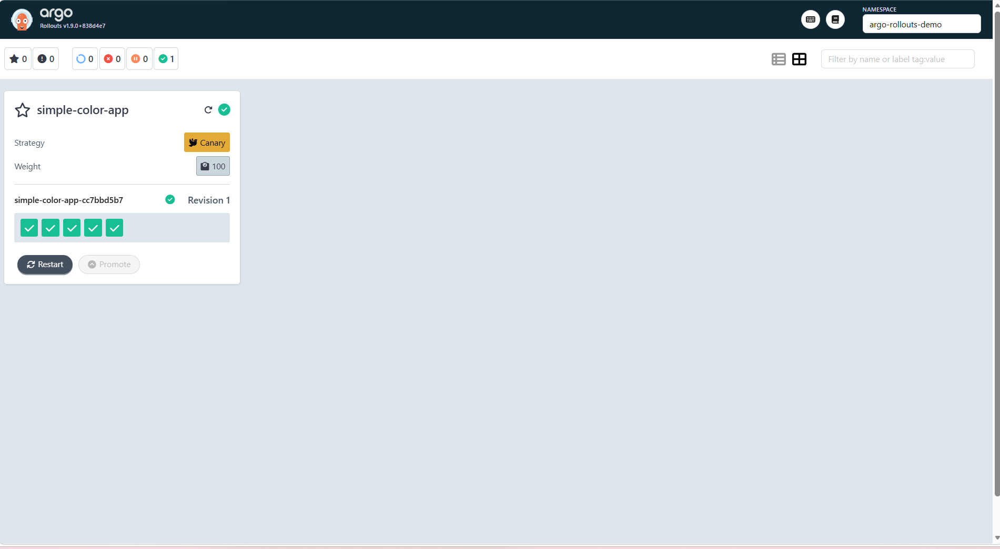
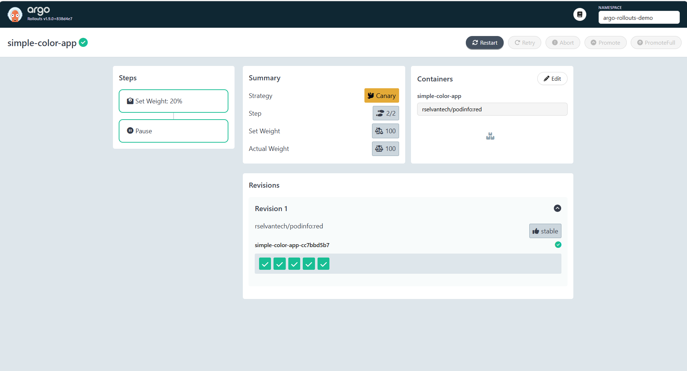
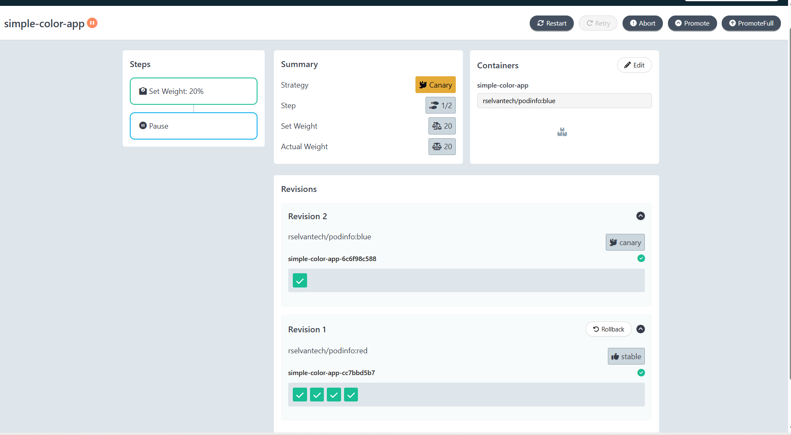
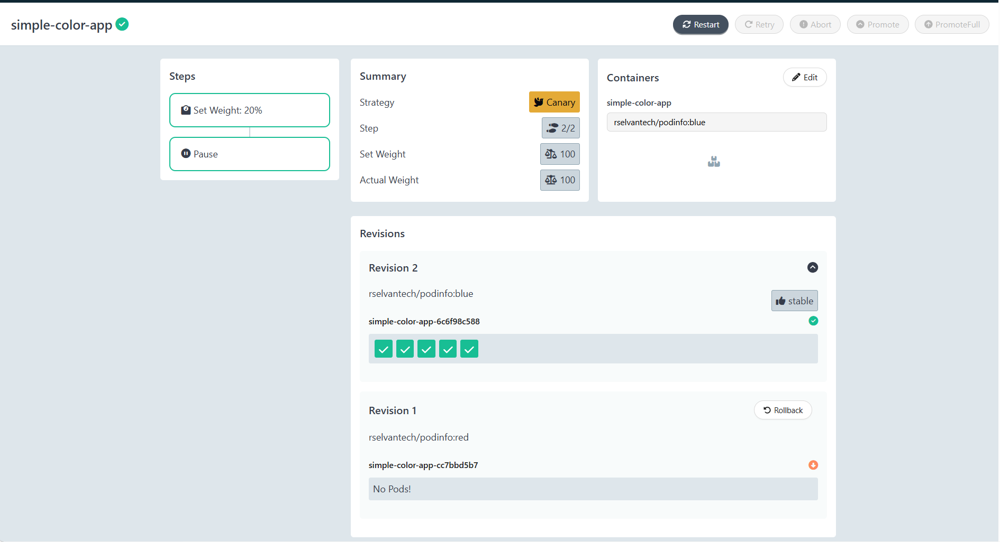

# Demo-03: Canary Basics — Your First Rollout

## Overview

This is the first hands-on demo. You will build two versions of the podinfo
image, write a Rollout manifest, deploy the initial stable version, trigger
a canary update, watch the 20% pause, and promote it to completion — observing
every step in both the CLI dashboard and the web UI.

By the end of this demo you will have a working Rollout in your cluster, a
clear mental model of the canary release lifecycle, and a thorough
understanding of how the CLI and UI dashboards represent rollout state. All
subsequent demos build on this foundation.

**What you'll learn:**
- How the Rollout CRD differs from a Deployment in practice
- What happens when you apply a Rollout without a strategy field
- How canary steps (`setWeight`, `pause`) control the rollout lifecycle
- How to read every field in the CLI dashboard output — at each stage of a rollout
- How the web UI represents rollout state, revisions, and actions
- How to promote a rollout via both the CLI and the web UI
- How to abort a rollout and what the resulting state looks like
- How `argo-rollouts-config` fits into the four-repo picture alongside the ArgoCD series repos
- What the standalone vs ArgoCD-combined repo strategy means in practice

**What you'll do:**
- Create the `argo-rollouts-config` private GitHub repository
- Create a Docker Hub pull secret in the cluster
- Write and apply a `rollout.yaml` (podinfo:red, 5 replicas, canary strategy)
- Write and apply a `service.yaml` pointing to the Rollout pods
- Read the CLI dashboard output in detail against a real running rollout
- Walk through the web UI with a real rollout populating every panel
- Trigger a canary update (stable: red → canary: blue), observe the 20% pause
- Promote to completion via CLI, then repeat via the UI
- Abort a rollout and understand the Degraded state and recovery

---

## Prerequisites

- ✅ Completed Demo-02 — Argo Rollouts controller running in `argo-rollouts` namespace
- ✅ `kubectl argo rollouts` plugin installed and working
- ✅ Docker installed and logged into Docker Hub (`rselvantech`)
- ✅ GitHub account and a PAT with `repo` scope (same PAT from ArgoCD series)
- ✅ ArgoCD Demo-05 completed — Docker Hub private repo and PAT setup already done
- ✅ **`README-build-podinfo-images.md` completed** — `rselvantech/podinfo:red` and `rselvantech/podinfo:blue` pushed to Docker Hub

> **Before starting this demo**, complete
> [`README-build-podinfo-images.md`](./README-build-podinfo-images.md) in
> this folder. It covers cloning your podinfo fork, modifying the Dockerfile
> to bake in colour and message, and building and pushing both image tags.
> Demo-03 assumes both `:red` and `:blue` are already available in your
> private Docker Hub repo.
>
> **Reference:** Docker Hub PAT creation, permission levels, and the
> `docker-registry` secret pattern are covered in detail in
> **ArgoCD Demo-05 — `README-podinfo-setup.md` Steps 4–8**.
> This demo follows the same pattern. If you have not done Demo-05,
> read that section before continuing here.

**Verify:**
```bash
kubectl get pods -n argo-rollouts
# Expected: argo-rollouts pods Running 1/1

kubectl argo rollouts version
# Expected: version string

docker info | grep Username
# Expected: Username: rselvantech


kubectl port-forward svc/argo-rollouts-dashboard 3100:3100 -n argo-rollouts &
# Open your browser: **http://localhost:3100/rollouts**
```

---

## Concepts

### The Four-Repo Picture — Where `argo-rollouts-config` Fits

Before creating any repository, it is important to understand exactly how
the new `argo-rollouts-config` repo relates to the three repos already
established in the ArgoCD series.

**The three repos from the ArgoCD series:**

```
rselvantech/podinfo              ← Repo 1: App source + Dockerfile (developer owns)
                                   CI builds images here, pushes to Docker Hub
                                   ArgoCD never reads this

rselvantech/podinfo-config       ← Repo 2: Kubernetes manifests (DevOps owns)
                                   Deployments, Services, ConfigMaps
                                   ArgoCD actively syncs this to the cluster

rselvantech/argocd-config        ← Repo 3: ArgoCD Application CRDs (platform owns)
                                   ArgoCD reads this from Demo-12 (App-of-Apps in Argo CD)
                                   kubectl apply used until then
```

**The fourth repo — added for Argo Rollouts:**

```
rselvantech/argo-rollouts-config ← Repo 4: Rollout manifests for demos 03–11
                                   Rollout CRDs, Services, AnalysisTemplates
                                   Applied manually: kubectl apply
                                   ArgoCD NEVER reads this repo
                                   Purpose: version control for standalone demos
```

**Why a fourth repo and not reuse repo 2 (`podinfo-config`)?**

- `podinfo-config` holds manifests that ArgoCD actively syncs to the cluster.
Mixing standalone Argo Rollouts demo manifests into that repo creates
ambiguity — which manifests is ArgoCD managing, and which are being applied
manually? A clean separation keeps each repo's purpose unambiguous and
mirrors how real teams structure their GitOps repos.

- Also this helps to keep all Argo Rollouts demos as standalone one.No dependence on Argo CD

**How the four repos are used across the full series:**

```
Standalone Argo Rollouts demos (03–11):
  argo-rollouts-config ← the ONLY repo involved
  kubectl apply → manifests applied directly
  No ArgoCD involvement

proj-02 (ArgoCD + Argo Rollouts integration):
  podinfo-config       ← Rollout manifests replace Deployment manifests here
                          ArgoCD syncs Rollout resources to the cluster
  argocd-config        ← ArgoCD Application CRDs pointing to podinfo-config
  argo-rollouts-config ← NOT used in proj-02 (standalone demos only)
```

**The complete four-repo picture:**

```
Developer                DevOps / Platform               Platform Team
     │                          │                              │
     ▼                          ▼                              ▼
rselvantech/podinfo    rselvantech/podinfo-config    rselvantech/argocd-config
source + Dockerfile    K8s manifests (Deployment     ArgoCD Application CRDs
                       in ArgoCD demos, Rollout       ArgoCD reads from Demo-12
                       in proj-02)
                                 │
                       rselvantech/argo-rollouts-config
                       Rollout manifests for demos 03–11
                       kubectl apply only — ArgoCD never reads
```

> **Key insight:**  In proj-02 where we use both Argo CD + Argo Rollouts, Repos 2 and 3 from the ArgoCD series are used exactly as in the ArgoCD series — repo 2 will also hold the Rollout manifests along with K8s manifests and  ArgoCD will use the repo to sync, repo 3 will hold the Application CRDs. Hence The fourth repo (`argo-rollouts-config`) will not be required in proj-02 and its is exclusive to be used for Argo Rollluts standalone demos only.

---

### The Canary Strategy — How It Works

A canary rollout maintains two ReplicaSets simultaneously during an update:
the **stable** ReplicaSet (current production version) and the **canary**
ReplicaSet (new version). Traffic is split between them according to the
steps you define.

```
Initial state — all traffic on stable (red):
  Service → [pod-red, pod-red, pod-red, pod-red, pod-red]
             all 5 pods are revision:1 (red), canary ReplicaSet has 0 replicas

Update triggered — image changed from red to blue:

  Step 1: setWeight: 20
    → canary ReplicaSet scales up to 1 pod (blue)
    → stable ReplicaSet scales down to 4 pods (red)
    → Service routes to all 5 pods (1 blue + 4 red)
    → ~20% of traffic hits the blue canary pod
    → Rollout enters Paused state — waiting for promotion

  Step 2: pause: {} (indefinite)
    → Nothing happens automatically.
    → Human observes the canary, then promotes or aborts.

  After promotion:
    → canary ReplicaSet scales up to 5 pods (blue)
    → stable ReplicaSet scales down to 0 pods (red, kept for rollback)
    → All traffic on blue. Status: Healthy.
    → Blue ReplicaSet is now labelled stable.
```

### Why Canary Uses One Service — and Blue-Green Uses Two

This demo uses a single Service pointing at both stable and canary pods
simultaneously. Demo-04 (blue-green) uses two Services. The reason for
the difference is fundamental to how each strategy controls traffic.

**Canary — one Service, traffic split by pod ratio:**

The canary strategy deliberately mixes stable and canary pods behind the
same Service. The selector matches all pods with `app: simple-color-app`
regardless of which ReplicaSet they belong to. Kubernetes Service load
balancing round-robins across all matching endpoints. With 4 stable pods
and 1 canary pod, roughly 80% of requests go to stable and 20% to canary.
This is intentional — real production traffic hits the canary in proportion
to the weight you set.

```
Single Service: simple-color-app
  selector: app: simple-color-app        ← matches ALL pods (both ReplicaSets)
  endpoints: [red, red, red, red, blue]  ← 4 stable + 1 canary
  traffic split: ~80% red / ~20% blue    ← approximated by pod count ratio
```

**Blue-green — two Services, traffic split by selector switch:**

Blue-green works differently. The old version must keep receiving 100% of
production traffic while the new version is tested in complete isolation —
zero production traffic reaches it during testing. A single Service cannot
do this because it would mix both versions together.

Two Services solve this by each pointing at a different ReplicaSet:
- `activeService`: all production traffic, selector points at stable pods
- `previewService`: zero production traffic, selector points at new pods

On promotion, Argo Rollouts flips the `activeService` selector to point
at the new pods — instant cutover, no mixing, no partial traffic.

```
activeService selector → stable pods only  (100% of production traffic)
previewService selector → new pods only    (0% of production traffic, testing only)

On promote:
  activeService selector → new pods        (100% of production traffic, instant)
  old pods scaled down after delay
```

This distinction — one Service for canary, two Services for blue-green —
directly reflects the purpose of each strategy. Canary intentionally
exposes real users to the new version gradually. Blue-green intentionally
shields real users from the new version until you decide to cut over.
Both use the same underlying Service mechanism, just wired differently.

### What podinfo Is and Why It Is Used Here

This is the same podinfo used in Argo Cd Demos [Refer Argo CD Demo 05](../../argo-cd-basics-to-prod/05-private-repos-and-production-setup/README-podinfo-setup.md) for more info. It is a small open-source Go web application created specifically for
testing and demonstrating Kubernetes tooling. It is maintained by the
CNCF ecosystem and used throughout this series because:

- It exposes `/healthz` and `/readyz` endpoints out of the box — probes work immediately
- The UI background colour is controlled by the `PODINFO_UI_COLOR` env var — version differences are instantly visible in the browser
- `PODINFO_UNHEALTHY=true` simulates a failing pod on demand — useful for abort demos
- Sub-second startup time — pod cycling during rollouts is fast and observable
- Native Prometheus metrics at `/metrics` — used in Demos 09 and 10

In this demo, `rselvantech/podinfo:red` serves a red background and
`rselvantech/podinfo:blue` serves a blue background. The colour change is
the visible signal that the canary version is different from stable.

### The Strategy Field Is Required

A Rollout resource without a `strategy` field is accepted by the Kubernetes
API server — `kubectl apply` returns success. But the Argo Rollouts
controller immediately marks the Rollout as `Degraded` with an
`InvalidSpec` error. This is demonstrated in Step 3 of this demo so you
recognise the error and its cause if you encounter it.

```
Status without strategy field:
  Status:   ✖ Degraded
  Message:  InvalidSpec: Rollout has missing field '.spec.strategy'
```

### Pod Visual Identification

Kubernetes pod names follow the pattern `<rollout-name>-<replicaset-hash>-<pod-hash>`.
You cannot set pod names to "red" or "blue". However, the two image versions
are visually distinguishable in three ways:

1. **Browser UI** — `PODINFO_UI_COLOR` shows red or blue background, `PODINFO_UI_MESSAGE` shows the version label
2. **Image field** — `kubectl argo rollouts get rollout` shows `rselvantech/podinfo:red (stable)` vs `rselvantech/podinfo:blue (canary)` in the Images line
3. **Pod describe** — `kubectl describe pod <pod>` shows the image tag under the Container section

These three make it immediately clear which version any pod is running
without needing to control the pod name.

---

## Folder Structure

```
03-canary-basics/
├── README.md                                   ← This file
├── README-build-podinfo-images.md              ← Prereuisite for this demo
└── src/
      ├──argo-rollouts-config/                  ← git init → remote: rselvantech/argo-rollouts-config
      │   └── 03-canary-basics/
      │       ├── rollout.yaml                  ← Rollout CRD with canary strategy
      │       └── service.yaml                  ← Service pointing to Rollout pods
      └──podinfo/                               ← git init → remote: rselvantech/podinfo
          ├── Dockerfile                        ← original, untouched
          ├── 03-canary-basics/
          │   └── Dockerfile                    ← modified: ARG UI_COLOR + ENV PODINFO_UI_COLOR added in final stage
          ├── cmd/                              ← Go source, unchanged
          ├── pkg/                              ← Go source, unchanged
          ├── ui/                               ← UI assets, required by COPY ./ui ./ui in Dockerfile
          ├── go.mod
          └── ...
```

> **`gitops-labs` vs `argo-rollouts-config`:**
> `gitops-labs` is your learning and documentation repo — it holds READMEs
> and is never applied to the cluster. `argo-rollouts-config` is the
> working manifests repo — its contents are applied with `kubectl apply`
> in every demo. They are separate repositories serving separate purposes,
> following the same separation established in the ArgoCD series.

---

## Step 1: Check Podinfo Images


```bash
docker images | grep podinfo
```

**Expected:**

```text
rselvantech/podinfo   blue   <digest>   1 minute ago    ~50MB
rselvantech/podinfo   red    <digest>   3 minutes ago   ~50MB
```


**If does not exist locally , try to pull:**
```
docker pull rselvantech/podinfo:red
docker pull rselvantech/podinfo:blue
```

---

## Step 2: Create the `argo-rollouts-config` Repository

### Step 2-1: Create the private GitHub repository

1. Go to github.com → **New repository**
2. Repository name: `argo-rollouts-config`
3. Visibility: **Private**
4. Description: `Rollout manifests for Argo Rollouts standalone demos`
5. Do NOT initialise with README
6. Click **Create repository**

> **GitHub PAT reminder:** Create a new PAT or Use the same GitHub PAT created during the ArgoCD series buy adding this repo to its existing repo list

### Step 2-2: Set up the local working directory

```bash
cd argo-rollouts-basics-to-prod/03-canary-basics/src

mkdir argo-rollouts-config && cd argo-rollouts-config

git init
git branch -M main

# Add the private remote — PAT embedded in URL for authentication
# Same PAT used in ArgoCD series (repo scope required)
git remote add origin \
  https://rselvantech:<YOUR-GITHUB-PAT>@github.com/rselvantech/argo-rollouts-config.git

# Create the demo-03 subdirectory
mkdir -p 03-canary-basics
```
---

## Step 3: Create the `argo-rollouts-demo` Namespace

```bash
kubectl create namespace argo-rollouts-demo
```

All demos in this series use `argo-rollouts-demo` as the working namespace.

**Verify:**
```bash
kubectl get namespace argo-rollouts-demo
# Expected: argo-rollouts-demo   Active   Xs
```

---

## Step 4: Create the Docker Hub Pull Secret

Your podinfo images are in a **private** Docker Hub repository. Minikube's
container runtime must authenticate with Docker Hub before it can pull them.
This requires a `docker-registry` type Kubernetes Secret in the same
namespace as the pods.

```bash
kubectl create secret docker-registry dockerhub-secret \
  --docker-server=https://index.docker.io/v1/ \
  --docker-username=rselvantech \
  --docker-password='<your-dockerhub-read-only-pat>' \
  --docker-email=<your-email> \
  --namespace=argo-rollouts-demo
```

> **Use a Read-only PAT** — the minimum permission needed to pull private
> images. See ArgoCD Demo-05 Lessons Learned section for the full PAT
> permission level table and the single-quote wrapping rule.

> **`index.docker.io/v1/` is the correct server** — not `hub.docker.com`.
> See ArgoCD Demo-05 Lessons Learned for why these are different endpoints.

**Verify the secret was created:**
```bash
kubectl get secret dockerhub-secret -n argo-rollouts-demo
```

**Expected:**
```
NAME               TYPE                             DATA   AGE
dockerhub-secret   kubernetes.io/dockerconfigjson   1      5s
```

> **`imagePullSecrets` is namespace-scoped.** This secret only exists in
> `argo-rollouts-demo`. If you create Rollouts in a different namespace
> in future demos, you must recreate the secret there too. See ArgoCD
> Demo-05 Lessons Learned point 6 for the full explanation.

---

## Step 5: Write the Rollout Manifest — Intentionally Broken First

Before writing the correct manifest, intentionally create a Rollout without
a strategy field to observe the error. This is the most common first mistake
and understanding it prevents confusion in later demos.

```bash
cd argo-rollouts-basics-to-prod/03-canary-basics/src/argo-rollouts-config

touch 03-canary-basics/rollout.yaml
```

**Create `src/argo-rollouts-config/03-canary-basics/rollout.yaml` with no strategy field:**

```yaml
apiVersion: argoproj.io/v1alpha1
kind: Rollout
metadata:
  name: simple-color-app
  namespace: argo-rollouts-demo
spec:
  replicas: 5
  selector:
    matchLabels:
      app: simple-color-app
  template:
    metadata:
      labels:
        app: simple-color-app
    spec:
      imagePullSecrets:
        - name: dockerhub-secret
      containers:
        - name: simple-color-app
          image: rselvantech/podinfo:red
          ports:
            - containerPort: 9898
```

**Apply it:**
```bash
kubectl apply -f 03-canary-basics/rollout.yaml
```

**Expected output:**
```
rollout.argoproj.io/simple-color-app created
```

`kubectl apply` succeeds — no client-side validation. The controller
catches the issue server-side.

**Check the rollout status:**
```bash
kubectl argo rollouts get rollout simple-color-app -n argo-rollouts-demo
```

**Expected:**
```
Name:            simple-color-app
Namespace:       argo-rollouts-demo
Status:          ✖ Degraded
Message:         InvalidSpec: Rollout has missing field '.spec.strategy'
```

**Key observation:** The API server accepted the manifest. The Argo Rollouts
controller rejected it immediately on reconciliation with `InvalidSpec`.
`created` does not mean `healthy` — always check status after applying.

If you open the web UI (`http://localhost:3100/rollouts`) now, the rollout
will not appear. This is expected — the UI reflects the controller's view and the controller has marked this invalid.
Fixing the strategy resolves it.

---

## Step 6: Fix the Rollout — Add the Canary Strategy

**Update `src/argo-rollouts-config/03-canary-basics/rollout.yaml` with the complete correct manifest:**

```yaml
apiVersion: argoproj.io/v1alpha1
kind: Rollout
metadata:
  name: simple-color-app
  namespace: argo-rollouts-demo
spec:
  replicas: 5
  selector:
    matchLabels:
      app: simple-color-app
  template:
    metadata:
      labels:
        app: simple-color-app
    spec:
      imagePullSecrets:
        - name: dockerhub-secret       # ← pulls from private Docker Hub
      containers:
        - name: simple-color-app
          image: rselvantech/podinfo:red
          ports:
            - name: http
              containerPort: 9898
          readinessProbe:
            httpGet:
              path: /readyz
              port: 9898
            initialDelaySeconds: 5
            periodSeconds: 5
            failureThreshold: 3
          livenessProbe:
            httpGet:
              path: /healthz
              port: 9898
            initialDelaySeconds: 10
            periodSeconds: 10
            failureThreshold: 3
          resources:
            requests:
              cpu: 100m
              memory: 64Mi
            limits:
              memory: 256Mi
  strategy:
    canary:
      steps:
        # Step 1: Route 20% of traffic to the canary version.
        # With 5 replicas: 1 canary pod + 4 stable pods = ~20% canary traffic.
        - setWeight: 20
        # Step 2: Pause indefinitely — wait for human approval.
        # Resume with: kubectl argo rollouts promote simple-color-app -n argo-rollouts-demo
        # Or click Promote in the web UI.
        - pause: {}
```

**Apply the fixed manifest:**
```bash
kubectl apply -f 03-canary-basics/rollout.yaml
```

**Watch the initial deployment:**
```bash
kubectl argo rollouts get rollout simple-color-app -n argo-rollouts-demo --watch
```

**Expected — pods starting (Progressing):**
```
Name:            simple-color-app
Namespace:       argo-rollouts-demo
Status:          ⟳ Progressing
Strategy:        Canary
  Step:          0/2
  SetWeight:     0
  ActualWeight:  0
Images:          rselvantech/podinfo:red
Replicas:
  Desired:       5
  Current:       0
  Updated:       0
  Ready:         0
  Available:     0

NAME                                    KIND        STATUS        AGE
⟳ simple-color-app                     Rollout     ⟳ Progressing  5s
└──# revision:1
   └──⧉ simple-color-app-xxxxxxxxxx    ReplicaSet  ⟳ Progressing  5s
      ├──□ simple-color-app-xxx-xxx    Pod         ⟳ ContainerCreating  5s
      ...
```

**Expected — all pods running (Healthy):**
```
Name:            simple-color-app
Namespace:       argo-rollouts-demo
Status:          ✔ Healthy
Strategy:        Canary
  Step:          2/2
  SetWeight:     100
  ActualWeight:  100
Images:          rselvantech/podinfo:red (stable)
Replicas:
  Desired:       5
  Current:       5
  Updated:       5
  Ready:         5
  Available:     5

NAME                                    KIND        STATUS     AGE   INFO
⟳ simple-color-app                     Rollout     ✔ Healthy  45s
└──# revision:1
   └──⧉ simple-color-app-xxxxxxxxxx    ReplicaSet  ✔ Healthy  45s   stable
      ├──□ simple-color-app-xxx-xxx    Pod         ✔ Running  40s   ready:1/1
      ├──□ simple-color-app-xxx-xxx    Pod         ✔ Running  40s   ready:1/1
      ├──□ simple-color-app-xxx-xxx    Pod         ✔ Running  40s   ready:1/1
      ├──□ simple-color-app-xxx-xxx    Pod         ✔ Running  40s   ready:1/1
      └──□ simple-color-app-xxx-xxx    Pod         ✔ Running  40s   ready:1/1
```

**Key observation:** On the initial deployment, Argo Rollouts does NOT run
the canary steps. It deploys all replicas directly to the desired state as
fast as possible. Canary steps only run when an UPDATE is triggered against
an existing stable version. There is nothing to protect on first deploy.

---

## Step 7: Read the CLI Dashboard Output — Field by Field

Now that you have a real rollout running, this is the right moment to
understand every field the CLI dashboard shows. This section fulfils the
reference introduced in Demo-02 Step 7.

Run the command without `--watch` to see a static snapshot:

```bash
kubectl argo rollouts get rollout simple-color-app -n argo-rollouts-demo
```

**Annotated output — Healthy state after initial deployment:**

```
Name:            simple-color-app       ← name of the Rollout resource
Namespace:       argo-rollouts-demo     ← namespace it lives in
Status:          ✔ Healthy             ← overall rollout health (see symbols below)
Message:                                ← empty when Healthy; shows error text when Degraded
Strategy:        Canary                 ← strategy type from spec.strategy
  Step:          2/2                    ← current step index / total steps defined
                                           2/2 = all steps completed = fully promoted
  SetWeight:     100                    ← the weight Argo Rollouts has instructed
                                           the traffic layer to apply to the canary
  ActualWeight:  100                    ← the weight currently confirmed as active
                                           (matches SetWeight when no traffic router lag)
Images:          rselvantech/podinfo:red (stable)
                                        ← one line per active image
                                           (stable) = this is the current production image
                                           (canary) = shown during an active update
Replicas:
  Desired:       5                      ← spec.replicas — what you asked for
  Current:       5                      ← total pods currently running (stable + canary)
  Updated:       5                      ← pods running the latest (canary) image
  Ready:         5                      ← pods passing readiness probe
  Available:     5                      ← pods ready AND past minReadySeconds
```

**The resource tree section:**

```
NAME                                    KIND        STATUS     AGE   INFO
⟳ simple-color-app                     Rollout     ✔ Healthy  2m
└──# revision:1                                                      ← ReplicaSet revision number
                                                                        higher number = newer version
   └──⧉ simple-color-app-xxxxxxxxxx    ReplicaSet  ✔ Healthy  2m    stable
   │                                                                 ← INFO column:
   │                                                                    stable = current production RS
   │                                                                    canary = new version RS
   │                                                                    ScaledDown = RS at 0 replicas
   ├──□ simple-color-app-xxx-xxx       Pod         ✔ Running  2m    ready:1/1
   ...                                                               ← ready:X/Y = X containers
                                                                        ready out of Y total
```

**Status symbols — memorise these:**

| Symbol | Meaning | When you see it |
|---|---|---|
| `✔` | Healthy / Succeeded | Rollout fully promoted and running |
| `⟳` | Progressing | Pods starting, rollout steps executing |
| `⏸` | Paused | Waiting at a `pause: {}` step — needs promotion |
| `✖` | Degraded / Failed | InvalidSpec, aborted, or analysis failed |
| `!` | Warning | Requires attention |
| `•` | ScaledDown | ReplicaSet exists at 0 replicas (kept for rollback) |

**`SetWeight` vs `ActualWeight` — when they differ:**

During a canary without a traffic router (demos 03–10), both values are
calculated from pod counts and converge within seconds of a pod passing
readiness. With a traffic router like Traefik (Demo-11), there is a brief
lag while the router applies the route rule — during that lag you see
`SetWeight: 20` and `ActualWeight: 0` until the router confirms.
If they stay different for more than a few seconds, the traffic router
integration is misconfigured.

**`Desired` vs `Current` vs `Updated` vs `Ready` vs `Available`:**

| Field | What it means | When they differ |
|---|---|---|
| `Desired` | `spec.replicas` | Never changes unless you edit the spec |
| `Current` | Total pods existing | Exceeds `Desired` briefly during scale-up |
| `Updated` | Pods on the new (canary) image | Less than `Desired` during a canary |
| `Ready` | Pods passing readiness probe | Less than `Current` during startup |
| `Available` | Ready + past `minReadySeconds` | Less than `Ready` if `minReadySeconds > 0` |

---

## Step 8: Create the Service


**Create `src/argo-rollouts-config/03-canary-basics/service.yaml`:**

```yaml
apiVersion: v1
kind: Service
metadata:
  name: simple-color-app
  namespace: argo-rollouts-demo
spec:
  # The selector matches ALL pods from both the canary and stable ReplicaSets.
  # Argo Rollouts uses pod count ratio to approximate the configured traffic
  # weight without a dedicated ingress controller.
  # With setWeight: 20 and 5 replicas:
  #   1 canary pod  = ~20% of requests
  #   4 stable pods = ~80% of requests
  selector:
    app: simple-color-app
  ports:
    - name: http
      port: 80
      targetPort: 9898
      protocol: TCP
```

**Apply:**
```bash
kubectl apply -f 03-canary-basics/service.yaml
```

**Verify endpoints are registered:**
```bash
kubectl get endpoints simple-color-app -n argo-rollouts-demo
```

**Expected:**
```
NAME               ENDPOINTS                                                   AGE
simple-color-app   10.x.x.x:9898,10.x.x.x:9898,10.x.x.x:9898 + 2 more...   5s
```

All 5 pod IPs are listed — the Service selector correctly matches all
Rollout pods.

**Access the application:**
```bash
minikube service simple-color-app -n argo-rollouts-demo --url
```

Open the URL in your browser. You should see the podinfo UI with:
- Red background (`#e74c3c`)
- Message: `v1 — stable (red)`
- Hostname showing the pod name
- Version info

---

## Step 9: Walk Through the Web UI — with a Real Rollout

> This section fulfils the note in Demo-02 Step 6 that said "come back
> here after completing Demo-03 when you have a real rollout running."
> Open the dashboard now: **http://localhost:3100/rollouts**

### Main List View



Click the rollout name to open the detail view.


This is the landing page. Every Rollout in the selected namespace appears as a card.

**Namespace selector (top-right):** Shows `argo-rollouts-demo` — you need to switch from `default` to your demo namespace. Always verify this matches the namespace where your Rollout lives before concluding the dashboard is empty or broken.


**Summary counters (top-left):**

| Icon | Count | Meaning |
|---|---|---|
| ⭐ | 0 | Rollouts with no strategy (bare Rollout — covered in a later step) |
| ℹ️ | 0 | Rollouts with a degraded or unknown condition |
| 🔵 | 0 | Rollouts currently progressing |
| ❌ | 0 | Rollouts in a failed or aborted state |
| ✅ | 1 | Rollouts in a healthy, fully promoted state |

> All traffic is on stable — the `✅ 1` counter confirms exactly one Rollout is fully healthy with no active canary in progress.

**The Rollout card:**

| Field | Value | Meaning |
|---|---|---|
| Name | `simple-color-app` | Your Rollout name |
| Strategy | `Canary` (yellow badge) | Canary strategy is configured |
| Weight | `100` | 100% of traffic on stable — no canary active |
| Revision | `Revision 1` | First and only revision — no update has been triggered yet |
| Pods | 5 green ✅ | All 5 replicas running and ready |
| Buttons | `Restart` (active) / `Promote` (greyed out) | Promote is disabled — nothing to promote when stable is at 100% |

> **Promote is greyed out** at this state. It only becomes active when a canary update is in progress and the Rollout is paused waiting for manual promotion. You will see it activate in the next step when you trigger the canary update.

---

### Rollout Detail View — Healthy State




**Steps panel (left):**

Shows your two configured canary steps:
- `Set Weight: 20%` — first step, currently completed (highlighted with border)
- `Pause` — second step, currently completed

> Both steps show as completed because the initial deployment goes through all steps automatically when deploying the stable version for the first time — there is no canary to pause on. Steps only pause and wait during an *update* from one revision to another.

**Summary panel (centre):**

| Field | Value | Meaning |
|---|---|---|
| Strategy | `Canary` | Confirmed canary strategy |
| Step | `2/2` | Both steps completed |
| Set Weight | `100` | Target weight for canary — 100% means fully promoted |
| Actual Weight | `100` | Live traffic weight — matches set weight, no drift |

> `Set Weight: 100` and `Actual Weight: 100` at stable state means all traffic is on the stable ReplicaSet. When a canary update is in progress you will see `Set Weight: 20` and `Actual Weight: 20` here — reflecting the 20% pause step.

**Containers panel (right):**

Shows `rselvantech/podinfo:red` — the image currently running. The **Edit** button allows you to trigger an image update directly from the UI, which you will use in the next step to initiate the canary update to `:blue`.

**Revisions panel (bottom):**

| Field | Value | Meaning |
|---|---|---|
| Revision 1 | `rselvantech/podinfo:red` | The image for this revision |
| Badge | `stable` | This revision is the current stable — all traffic pointing here |
| ReplicaSet | `simple-color-app-cc7bbd5b7` | The ReplicaSet backing this revision |
| Pods | 5 green ✅ | All 5 pods healthy |

> The `stable` badge is key. When you trigger a canary update in the next step, Revision 2 will appear here with a `canary` badge alongside Revision 1 which retains the `stable` badge — both visible simultaneously, each showing their respective pod counts and health.

**Action buttons (top-right of detail view):**

| Button | State | Meaning |
|---|---|---|
| `Restart` | Active | Restarts all pods in a rolling fashion without changing the image |
| `Retry` | Greyed out | Only active after an aborted rollout |
| `Abort` | Greyed out | Only active during an in-progress canary update |
| `Promote` | Greyed out | Only active when paused at a canary step |
| `PromoteFull` | Greyed out | Only active during a canary — skips all remaining steps immediately |

> **All action buttons except `Restart` are greyed out** because there is no active canary update in progress. In the next step, when you trigger the update to `:blue` and the Rollout pauses at the 20% step, `Abort`, `Promote`, and `PromoteFull` will all become active simultaneously.


**What to note in Healthy state:**
- Both steps show as complete — the initial deployment ran through all steps
  directly since there was no prior stable version to protect
- Only one revision is visible — revision:1 labelled `stable`
- The Actions buttons are present but not meaningful until an update is triggered
- `Promote` is greyed out — there is nothing to promote

Keep this view open in your browser — the next step will populate it with
the canary revision in real time.

---

## Step 10: Trigger a Canary Update

Push the initial manifests to the repo first:

```bash
cd ~/gitops-labs/argo-rollouts-config
git add 03-canary-basics/
git commit -m "feat: demo-03 initial rollout and service manifests (stable: red)"
git push -u origin main
```

Now trigger the canary update by changing the image from `:red` to `:blue`
and updating the message to show it is the canary version.

**Edit `03-canary-basics/rollout.yaml`** — change the image:

```yaml
          image: rselvantech/podinfo:blue   # ← was: podinfo:red
```

**Apply the update:**
```bash
kubectl apply -f 03-canary-basics/rollout.yaml
```

**Open a second terminal and watch the rollout:**
```bash
kubectl argo rollouts get rollout simple-color-app -n argo-rollouts-demo --watch
```

**Expected — canary executing (setWeight: 20, then paused):**

```
Name:            simple-color-app
Namespace:       argo-rollouts-demo
Status:          ⏸ Paused
Message:         CanaryPauseStep
Strategy:        Canary
  Step:          1/2
  SetWeight:     20
  ActualWeight:  20
Images:          rselvantech/podinfo:blue (canary)
                 rselvantech/podinfo:red (stable)
Replicas:
  Desired:       5
  Current:       5
  Updated:       1
  Ready:         5
  Available:     5

NAME                                    KIND        STATUS     AGE   INFO
⟳ simple-color-app                     Rollout     ⏸ Paused   3m
├──# revision:2                                                      ← NEW: canary revision
│  └──⧉ simple-color-app-yyyyyyyyyy    ReplicaSet  ✔ Healthy  30s   canary
│     └──□ simple-color-app-yyy-yyy    Pod         ✔ Running  28s   ready:1/1
└──# revision:1                                                      ← existing stable revision
   └──⧉ simple-color-app-xxxxxxxxxx    ReplicaSet  ✔ Healthy  3m    stable
      ├──□ simple-color-app-xxx-xxx    Pod         ✔ Running  3m    ready:1/1
      ├──□ simple-color-app-xxx-xxx    Pod         ✔ Running  3m    ready:1/1
      ├──□ simple-color-app-xxx-xxx    Pod         ✔ Running  3m    ready:1/1
      └──□ simple-color-app-xxx-xxx    Pod         ✔ Running  3m    ready:1/1
```

**Reading this output — what changed from the Healthy state:**

| Field | Before update | During canary pause | What it means |
|---|---|---|---|
| `Status` | `✔ Healthy` | `⏸ Paused` | Waiting at `pause: {}` step |
| `Message` | empty | `CanaryPauseStep` | Which pause type is active |
| `Step` | `2/2` | `1/2` | Step 1 (setWeight) ran; step 2 (pause) is current |
| `SetWeight` | `100` | `20` | 20% of traffic instructed to go to canary |
| `ActualWeight` | `100` | `20` | Confirmed: 1 canary pod out of 5 total |
| `Updated` | `5` | `1` | Only 1 pod has the new `:blue` image |
| `Images` | one line (stable) | two lines (canary + stable) | Two revisions running |
| Tree | one revision | two revisions | revision:2 (canary) + revision:1 (stable) |

**Verify the traffic split in the browser:**

**Open a new terminal and run:**

```bash
minikube service simple-color-app -n argo-rollouts-demo --url
```

**Expected output (approximate):**
```
 minikube service simple-color-app -n argo-rollouts-demo --url
😿  service argo-rollouts-demo/simple-color-app has no node port
❗  Services [argo-rollouts-demo/simple-color-app] have type "ClusterIP" not meant to be exposed, however for local development minikube allows you to access this !
http://127.0.0.1:44135
❗  Because you are using a Docker driver on linux, the terminal needs to be open to run it.
```

**Open a another terminal and run:**

```
#Run this loop using url obtained from previous step
for i in $(seq 1 20); do
  curl -s http://127.0.0.1:44135 | grep -o 'v[12] — [a-z]*'
done
```

**Expected output (approximate):**
```
v1 — stable
v1 — stable
v1 — stable
v1 — stable
v2 — canary
v1 — stable
v1 — stable
v1 — stable
v2 — canary
v1 — stable
...
```

Approximately 4 out of 5 responses are stable (red), 1 out of 5 is canary
(blue). The exact split varies due to load balancer randomness — over many
requests the average approaches 80/20.

**Check the web UI at this point:**

The dashboard should now show:




This screen shows the state immediately after triggering the update to `rselvantech/podinfo:blue` — the Rollout has completed Step 1 (`Set Weight: 20%`) and is now paused at Step 2 (`Pause`), waiting for manual promotion.

**Header:**

The Rollout name now shows an **orange pause icon** (⏸) next to `simple-color-app` — replacing the green ✅ from the stable state. This is your at-a-glance signal that the Rollout is mid-update and waiting for human intervention.

**Action buttons (top-right):**

| Button | State | Meaning |
|---|---|---|
| `Restart` | Active | Still available at any point |
| `Retry` | Greyed out | Nothing to retry — rollout is healthy, just paused |
| `Abort` | **Active** | Will stop the canary, scale down `:blue`, return all traffic to `:red` |
| `Promote` | **Active** | Advances past the current pause step — moves to `Set Weight: 40%` |
| `PromoteFull` | **Active** | Skips all remaining steps immediately — jumps straight to 100% on `:blue` |

> Compare this to Screen 2 where all buttons except `Restart` were greyed out. The moment a canary update is triggered and paused, `Abort`, `Promote`, and `PromoteFull` all activate simultaneously — these are your three decisions: wait and advance step-by-step, skip straight to full promotion, or abort entirely.

**Steps panel (left):**

| Step | State | Meaning |
|---|---|---|
| `Set Weight: 20%` | Highlighted with green border | Completed — 20% traffic shifted to canary |
| `Pause` | Highlighted with blue border | Current state — indefinite pause, waiting for `Promote` |

> Both steps are highlighted because the Rollout has reached the pause and is holding there. The connecting line between the two steps indicates the flow has progressed from Step 1 into Step 2.

**Summary panel (centre):**

| Field | Value | Meaning |
|---|---|---|
| Strategy | `Canary` | Unchanged |
| Step | `1/2` | Currently at Step 1 of 2 — the pause is Step 1's hold point |
| Set Weight | `20` | Target canary weight — 20% of traffic directed to `:blue` |
| Actual Weight | `20` | Live traffic weight — confirmed 20% actually flowing to canary |

> `Set Weight` and `Actual Weight` both show `20` — they match, meaning the traffic shift has fully taken effect. During a transition you may briefly see these differ; matching values confirm the shift is complete and stable.

**Containers panel (right):**

Shows `rselvantech/podinfo:blue` — the **desired** image for this update. This reflects the target state of the Rollout, not the current stable. Revision 1 (`:red`) is still serving 80% of traffic but the Containers panel always shows the image being rolled out.

**Revisions panel (bottom):**

Two revisions are now visible simultaneously — this is the core of canary visibility:

| Revision | Image | Badge | ReplicaSet | Pods |
|---|---|---|---|---|
| Revision 2 | `rselvantech/podinfo:blue` | `canary` | `simple-color-app-6c6f98c588` | 1 ✅ |
| Revision 1 | `rselvantech/podinfo:red` | `stable` | `simple-color-app-cc7bbd5b7` | 4 ✅ |

> **1 pod on canary, 4 pods on stable** — this is exactly 20% canary weight with 5 total replicas. Argo Rollouts calculated `20% of 5 = 1 pod` and scaled the canary ReplicaSet to 1 while keeping the stable ReplicaSet at 4. The pod counts are the live evidence of the weight split.

> **Revision 1 now has a `Rollback` button** — this appears on the previous stable revision whenever a canary is in progress. Clicking it is equivalent to `Abort` — it immediately returns all traffic to `:red` and scales down `:blue`. You will use this in the abort step later.

> **Both ReplicaSets are healthy (✅)** — `:blue` passed its readiness probe and is serving live traffic. If the canary pod had failed its readiness probe, the ✅ would be replaced with a ❌ and the Rollout would stall, prompting you to investigate before deciding to abort or wait.

**Key observations:**
- Both `[Promote]` and `[Abort]` buttons are now active — the rollout is
  waiting for a decision
- The Canary Steps panel shows exactly which step is waiting and why
- Revision 2 (canary, blue) has 1 pod — revision 1 (stable, red) has 4 pods
- The ratio directly maps to the 20% weight

---

## Step 11: Promote the Rollout — via CLI

```bash
kubectl argo rollouts promote simple-color-app -n argo-rollouts-demo
```

**Expected output:**
```
rollout 'simple-color-app' promoted
```

**Watch the completion:**
```bash
kubectl argo rollouts get rollout simple-color-app -n argo-rollouts-demo --watch
```

**Expected — during promotion (briefly 9 pods while scaling up):**
```
Status:          ⟳ Progressing
  Step:          2/2
  SetWeight:     100
  ActualWeight:  100
Images:          rselvantech/podinfo:blue (stable)
Replicas:
  Desired:       5
  Current:       9          ← briefly: 5 old + 4 new scaling up
  Updated:       4
  Ready:         9
  Available:     9
```

**Expected — promotion complete:**
```
Status:          ✔ Healthy
  Step:          2/2
  SetWeight:     100
  ActualWeight:  100
Images:          rselvantech/podinfo:blue (stable)
Replicas:
  Desired:       5
  Current:       5
  Updated:       5
  Ready:         5
  Available:     5

NAME                                    KIND        STATUS       AGE   INFO
⟳ simple-color-app                     Rollout     ✔ Healthy    5m
├──# revision:2
│  └──⧉ simple-color-app-yyyyyyyyyy    ReplicaSet  ✔ Healthy    2m    stable
│     ├──□ simple-color-app-yyy-yyy    Pod         ✔ Running    90s   ready:1/1
│     ├──□ ...                         Pod         ✔ Running    90s   ready:1/1
│     ├──□ ...                         Pod         ✔ Running    90s   ready:1/1
│     ├──□ ...                         Pod         ✔ Running    90s   ready:1/1
│     └──□ ...                         Pod         ✔ Running    90s   ready:1/1
└──# revision:1
   └──⧉ simple-color-app-xxxxxxxxxx    ReplicaSet  • ScaledDown  5m
```

**Key observations:**
- revision:2 is now labelled `stable` — blue is production
- revision:1 is `ScaledDown` (bullet symbol `•`) — red pods are gone but the
  ReplicaSet is kept at 0 replicas for fast rollback
- All 5 pods are running `:blue`
- Open the browser — all responses are now `v2 — canary (blue)` with blue background




**Open a another terminal and run:**

```
#Run this loop using url obtained from previous step
for i in $(seq 1 20); do
  curl -s http://127.0.0.1:44135 | grep -o 'v[12] — [a-z]*'
done
```

**Expected output (approximate):**
```
v2 — canary
v2 — canary
v2 — canary
v2 — canary
v2 — canary
v2 — canary
v2 — canary
v2 — canary
v2 — canary
v2 — canary
v2 — canary
...
```

Now all the responses are from v2 canary (blue). 

---

## Step 12: Promote via Web UI — Repeat the Cycle

Trigger another update — this time promote via the web UI instead of CLI.

**Edit `03-canary-basics/rollout.yaml`** — change back to red:
```yaml
          image: rselvantech/podinfo:red
```

```bash
kubectl apply -f 03-canary-basics/rollout.yaml
```

Wait for the rollout to reach `⏸ Paused` at 20% canary (confirm in CLI).

Open `http://localhost:3100/rollouts` → click `simple-color-app` →
click **Promote** → click **Yes** to confirm.

Watch the CLI dashboard simultaneously to see the promotion proceed —
the same sequence as Step 11 but triggered from the UI.

---

## Step 13: Abort a Rollout

Trigger another update to blue, but this time abort it.

**Edit `03-canary-basics/rollout.yaml`** — change to blue:
```yaml
          image: rselvantech/podinfo:blue
```

```bash
kubectl apply -f 03-canary-basics/rollout.yaml
```

Confirm the rollout has reached `⏸ Paused` at 20% before aborting:

```bash
kubectl argo rollouts get rollout simple-color-app -n argo-rollouts-demo
# Wait until: Status: ⏸ Paused, Step: 1/2, Updated: 1
```

**Abort via CLI:**
```bash
kubectl argo rollouts abort simple-color-app -n argo-rollouts-demo
```

**Watch the result:**
```bash
kubectl argo rollouts get rollout simple-color-app -n argo-rollouts-demo --watch
```

**Expected — after abort:**
```
Name:            simple-color-app
Namespace:       argo-rollouts-demo
Status:          ✖ Degraded
Message:         RolloutAborted: Rollout aborted update to revision 5
Strategy:        Canary
  Step:          0/2
  SetWeight:     0
  ActualWeight:  0
Images:          rselvantech/podinfo:red (stable)
Replicas:
  Desired:       5
  Current:       5
  Updated:       5
  Ready:         5
  Available:     5
```

**Key observations:**
- Status is `✖ Degraded` — an aborted rollout is always Degraded
- The canary pod is gone — stable (red) is back to 5 pods
- Traffic is fully back on red

**Why Degraded instead of Healthy?**

The Rollout `spec` still says `image: blue` (that is what you applied).
The cluster is running `image: red` (the abort reverted it). Spec and
cluster do not match — Argo Rollouts marks this Degraded because the
desired state in the spec was not achieved.

This is an important distinction: Argo Rollouts does not modify your Git
repo or your spec. It only changes the cluster state. After an abort the
spec still points at the image that was aborted.

**Recover the Rollout:**

Edit `rollout.yaml` back to red (which already matches the running cluster):

```yaml
          image: rselvantech/podinfo:red
```

```bash
kubectl apply -f 03-canary-basics/rollout.yaml
kubectl argo rollouts get rollout simple-color-app -n argo-rollouts-demo
# Expected: Status returns to Healthy immediately
# No rollout steps run — spec and cluster already agree on red
```

---

## Step 14: Push Final Manifests

The rollout.yaml at the end of this demo should have
`image: rselvantech/podinfo:red` — the stable version matching the cluster.

```bash
cd ~/gitops-labs/argo-rollouts-config

git add 03-canary-basics/
git commit -m "feat: demo-03 final manifests — canary rollout stable on red"
git push origin main
```

---

## Verify Final State

```bash
# Rollout is Healthy on stable red image
kubectl argo rollouts get rollout simple-color-app -n argo-rollouts-demo
# Expected: Status Healthy, 5 pods, rselvantech/podinfo:red (stable)

# Service has 5 endpoints
kubectl get endpoints simple-color-app -n argo-rollouts-demo
# Expected: 5 pod IPs listed

# All pods running
kubectl get pods -n argo-rollouts-demo
# Expected: 5 pods Running 1/1

# Confirm running image is red
kubectl describe pod -l app=simple-color-app -n argo-rollouts-demo \
  | grep "Image:"
# Expected: Image: rselvantech/podinfo:red (5 times)
```

---

## Cleanup

Delete the Rollout and Service. The namespace is kept — all demos share
`argo-rollouts-demo`. The Docker Hub secret is also kept — subsequent
demos need it.

```bash
kubectl delete -f 03-canary-basics/rollout.yaml
kubectl delete -f 03-canary-basics/service.yaml

# Verify resources are gone
kubectl get all -n argo-rollouts-demo
# Expected: No resources found in argo-rollouts-demo namespace.
```

> **Why not `kubectl delete -f 03-canary-basics/`?**
> Deleting by directory applies deletions to every YAML file at once.
> For this demo either approach works. Deleting by individual file is
> shown here to establish the habit — in later demos where deletion
> order matters, explicit file-by-file deletion prevents errors.

---

## Key Concepts Summary

**Initial deployment skips canary steps**
Canary steps protect an existing stable version. On first deploy there is
no stable version — Argo Rollouts scales directly to the desired replica
count as fast as possible. Steps only run on subsequent updates.

**`kubectl apply` succeeds even for a broken Rollout spec**
The API server validates syntax. The controller validates semantics. A
missing `strategy` field passes syntax validation but fails semantic
validation — always check status with `kubectl argo rollouts get rollout`
after applying.

**Two ReplicaSets exist simultaneously during a canary**
The stable ReplicaSet runs the current production version. The canary
ReplicaSet runs the new version. Both are managed automatically — never
touch them directly.

**`pause: {}` waits forever until explicitly promoted or aborted**
Use `pause: {duration: 10m}` for a timed pause. Use `pause: {}` for a
manual gate requiring human approval.

**Abort does not return the Rollout to Healthy**
After abort: the spec points at the new image, the cluster runs the old
image. These do not match = Degraded. Fix by applying a spec that matches
the running cluster (the stable image).

**The stable ReplicaSet is kept at 0 replicas after promotion**
Not deleted — kept for fast rollback. Kubernetes just needs to scale it
back up. No pod recreation from scratch.

**Traffic split is approximate without a traffic router**
Without an ingress controller or service mesh, Argo Rollouts splits traffic
by pod count ratio. 20% means 1 out of 5 pods is canary. You will not see
an exact 80/20 split on small request counts but the average converges.
Fine-grained percentage control requires a traffic router (Demo-11).

**`argo-rollouts-config` is a standalone learning repo — not repo 2 or 3**
It is the fourth repo in the ecosystem. ArgoCD never reads it. In proj-02,
Rollout manifests move into `podinfo-config` (repo 2) where ArgoCD syncs
them — at that point `argo-rollouts-config` is no longer used for that app.

---

## Commands Reference

```bash
# Build and push images
docker build -t rselvantech/podinfo:red .
docker push rselvantech/podinfo:red
docker build -t rselvantech/podinfo:blue .
docker push rselvantech/podinfo:blue

# Create namespace
kubectl create namespace argo-rollouts-demo

# Create Docker Hub pull secret
kubectl create secret docker-registry dockerhub-secret \
  --docker-server=https://index.docker.io/v1/ \
  --docker-username=rselvantech \
  --docker-password='<pat>' \
  --namespace=argo-rollouts-demo

# Apply manifests
kubectl apply -f 03-canary-basics/rollout.yaml
kubectl apply -f 03-canary-basics/service.yaml

# Watch rollout progress (primary observation command)
kubectl argo rollouts get rollout simple-color-app -n argo-rollouts-demo --watch

# List rollouts in namespace
kubectl argo rollouts list rollouts -n argo-rollouts-demo

# Promote (advance past pause step)
kubectl argo rollouts promote simple-color-app -n argo-rollouts-demo

# Promote all the way (skip all remaining steps and analysis)
kubectl argo rollouts promote simple-color-app -n argo-rollouts-demo --full

# Abort (revert to stable)
kubectl argo rollouts abort simple-color-app -n argo-rollouts-demo

# Access application URL
minikube service simple-color-app -n argo-rollouts-demo --url

# Web UI dashboard
kubectl port-forward svc/argo-rollouts-dashboard 3100:3100 -n argo-rollouts
# Open: http://localhost:3100/rollouts
```

---

## Lessons Learned

**1. `kubectl apply` succeeds even for a broken Rollout spec**
The strategy field is required but not validated client-side. Always
check `kubectl argo rollouts get rollout <n>` after applying — do not
assume `created` means `healthy`.

**2. The first deployment is not a canary**
Canary steps protect an existing stable version. On first deploy there
is no stable version so Argo Rollouts deploys directly to full scale.

**3. Traffic split is approximate without a traffic router**
1 out of 5 pods is the canary = ~20%. The Kubernetes Service distributes
requests round-robin — you will not see an exact 80/20 split on a small
number of requests, but the average converges over many requests.
Fine-grained traffic control requires a traffic router (Demo-11).

**4. Abort leaves the Rollout Degraded**
Spec says new image. Cluster runs old image. Mismatch = Degraded.
Fix by applying a spec that matches the running cluster.

**5. Argo Rollouts never modifies your Git repo**
An abort, a failed analysis, or an automatic rollback only changes the
cluster state — never Git. After an abort, Git still points at the image
that was aborted. This is the GitOps tension covered in detail in proj-02.

**6. `argo-rollouts-config` is never read by ArgoCD**
In proj-02, Rollout manifests move to `podinfo-config`. Until then,
`argo-rollouts-config` is a standalone version-controlled manifest store
for the learning demos — nothing more.

---

## What's Next

**Demo-04: Blue-Green Basics**
Implement a blue-green rollout with an active Service receiving all
production traffic and a preview Service receiving no production traffic.
Deploy the new version to preview, run tests against it, then promote —
switching all production traffic in a single instant cutover.
Observe how blue-green differs from canary in both the CLI dashboard
and the web UI, and understand why two Services are required instead of one.